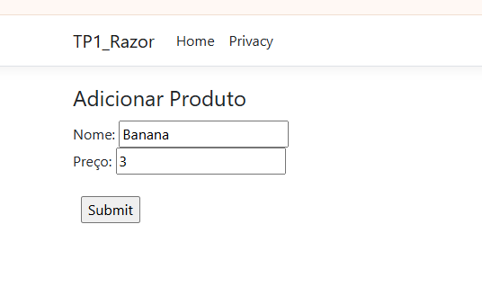
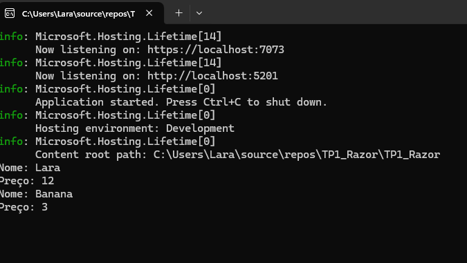

# Projeto ASP.NET Core com Razor Pages

## 8 Construção de Aplicação Web com Razor Pages

Aplicativos web baseados em Razor Pages são comuns em sistemas internos e portais administrativos.

**Tarefas:**

- Crie um novo projeto ASP.NET Core com Razor Pages.
- Crie uma página inicial (Index.cshtml) que exiba uma lista com três produtos (nome e preço).
- As informações podem estar fixas ou armazenadas em uma lista na página.
- Configure navegação básica entre as páginas.

Com este exercício você começa a construir aplicações web completas com estrutura MVC simplificada.

---

## 10 Implementação de Formulário em Razor Pages

Cadastros são uma funcionalidade central em aplicações web.

**Tarefas:**

- No projeto ProductCatalog, crie uma página AddProduct.cshtml.
- Implemente um formulário com dois campos: Nome e Preço.
- Ao submeter o formulário, exiba os dados preenchidos de volta na página.

Esse exercício mostra o ciclo básico de entrada e exibição de dados no modelo Razor Pages.

---

## 11 Manipulação de Strings com Delegates Encadeados

Transformações encadeadas são comuns em pipelines de processamento.

**Tarefas:**

- Crie um `Func<string, string, string>` que concatene nome e sobrenome.
- Encadeie mais dois métodos no delegate:
  - Um que converta a string para maiúsculas.
  - Outro que remova espaços em branco.
- Observe e analise o comportamento do resultado.

Esse exercício ajuda a compreender o comportamento de retorno em delegates multicast.

---

## 12 Integração de Delegates e Eventos em Aplicação Web

Sistemas modernos integram lógica de negócio com eventos para rastrear operações de forma centralizada.

**Tarefas:**

- No projeto ASP.NET, crie uma entidade `Event` com Título, Data e Local.
- Crie uma página que permita cadastrar eventos.
- Sempre que um novo evento for criado, dispare um delegate `Action<Event>` que registre a criação no console.

Este exercício conecta conceitos de eventos com aplicações web reais.
